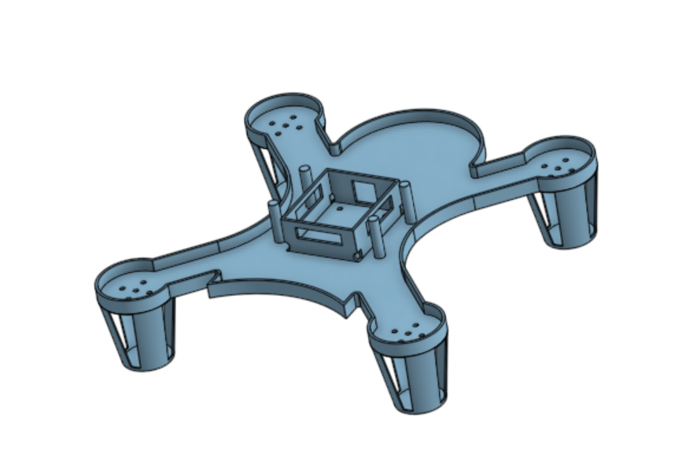
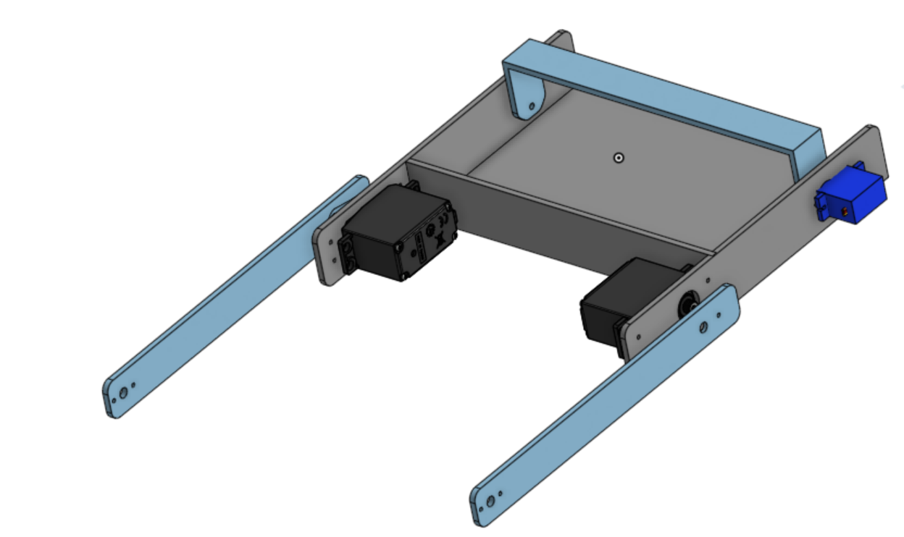

## 3D Design Files

This project includes custom 3D-designed STL files developed for the autonomous robotics system, competition robot assembly, and drone design.

### Included STL Designs

| File Name | Description |
|-----------|-------------|
| `Drone_design.stl` | Main drone/robot body structure design |
| `Unibot Gripper.stl` | Robotic gripper used for object collection and handling |
| `Unibot gripper box.stl` | Protective housing/support structure for the gripper mechanism |
| `Unibot side plate.stl` | Side plate component used for chassis support and mounting |

---

## Design Purpose

The STL components were designed to:

- Improve robot stability
- Support autonomous object collection
- Mount sensors and mechanical components
- Enhance overall structural performance
- Support competition-based robotic tasks

---

## 3D Printing

These STL files can be manufactured using standard 3D printers.

### Recommended Materials
- PLA
- PETG
- ABS

### Recommended Print Settings
- Layer Height: 0.2 mm
- Infill: 20–40%
- Supports: Enabled where necessary

---

## Project File Structure

```text

├── drone_design/
│   ├── Drone_design.stl
│   └── drone_design.png
│
├── Gripper_design/
│   ├── Unibot Gripper.stl
│   ├── Unibot gripper box.stl
│   ├── Unibot side plate.stl
│   └── gripper_design.png
```

---

## Design Preview

### Drone Design


### Gripper Design


---

## CAD and Mechanical Design

The mechanical components were designed for robotics applications including:

- Autonomous navigation
- Object handling
- Structural mounting
- Competition robot integration
- Lightweight and modular robotic assembly
